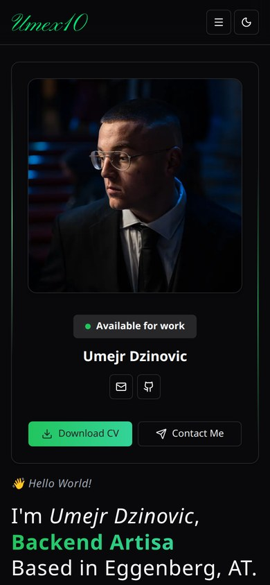
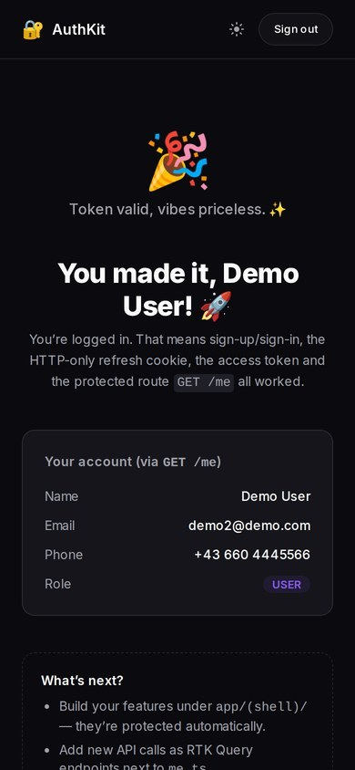
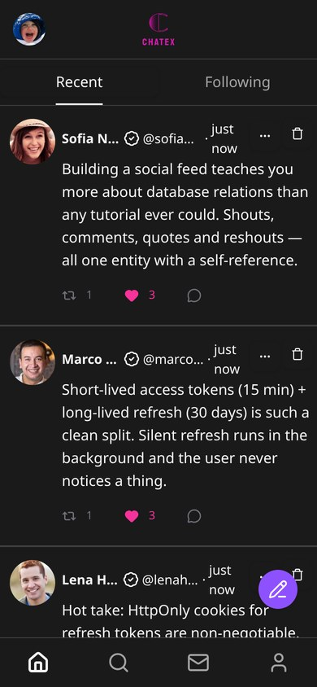
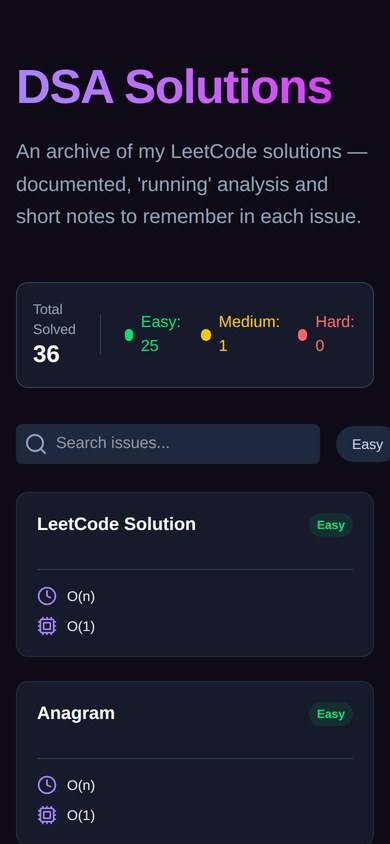
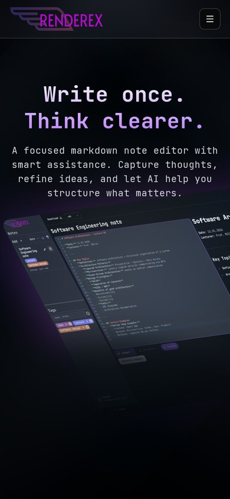

```text
           ... ..                                      Umex10@github ----------------------------------------------
       ..::::::...  .                                  . OS: ........................................... Linux Mint
     .=-----------::.........           ....           . Host: ............................................... Graz
     :%@@%%@@@@@@%#*+++=--:::.....::........           . Kernel: ..................... Software Engineering Student
.... +@@@@@@@@@@%#*==++=:...::::::...                  . IDE: .............................................. VSCode
... -@@@@@@@@@@*+=-==-:.  .:::...
    +@@@@@@@@@@*+===:........               ..         . Languages: ...................................... Java, TS
    #@@@@@@@@@%*++=:........  .             ..         . Languages.Frameworks: .................... Next.js, S-Boot
    @@@@@@@@@%*++=--..........               ..        . Languages.Markup: ................... HTML, CSS, SQL, YAML
   .%@@@@@@#+-:...:..   .....               .::.
 --:%#%@@@%+--==+*+=:.....                 ..  .       . Hobbies.Software: .................. Coding fullstack apps
+%+:#@%#@%+-:---##===::......           ..  .          . Hobbies.Focus: .................. Auth systems, clean APIs
=*+::++%@%=:.  :=-=:+: ..==-:...         .  ..
 +#= =@@@=:=:..-%%#*+===---::...        .              Contact ----------------------------------------------------
  #@#=@@+...-==+%@@@###*=-:::...       ..              . Work: ........................... umi.dzinovic10@gmail.com
   :-.@@=::...-*%@%##*=-:......        .. ..           . DevResume: ................... dev-resume-sigma.vercel.app
     :%=:.:::  -*%#*=-:::....           .              . GitHub: ........................................... Umex10
       *@*.   ..=*#*+-::.....               .-:
       =@@@+:::::===--::.....                 :-.      GitHub Stats -----------------------------------------------
       .%%%=----=-:::::.......              .  :+.     . Reps: .................... 9 | Followers: 7 | Following: 5
        +@@#=----=:...........              .: .*=     . Contributions: .......................... streak: 250 days
        :%*=-::-:::..........               ...-*::    . Labeld: ........................ authkit, chatex, renderex
...  ..:.:@@@#+=:..........                 . .+-::    . Stack.Live: ...................... Docker, Railway, Vercel
:::::::...@@@@#+-:.. .  .                    .=-.:.
::.:......=*+*=::........                   .::...
..... ......... .@@@@*--::....           .:-::...
```

<div align="center">

<a href="https://dev-resume-sigma.vercel.app"></a>
<a href="mailto:Umejr.Dzinovic@edu.fh-joanneum.at"></a>

</div>

---

## 🔍 Dives

---

<table>
<tr>
<td width="30%" valign="top">
  <a href="https://github.com/Umex10/dev-resume">
    
  </a>
</td>
<td width="70%" valign="top">

### 👤 Dev-Resume

**[github.com/Umex10/dev-resume](https://github.com/Umex10/dev-resume)** · **[live](https://dev-resume-sigma.vercel.app)**

My developer resume as a single-page site: intro, availability, apps, skills and a working contact form that sends mail through **Resend**.

Built with **Next.js 16** and **React 19**, animated with **Framer Motion**, charts via **Recharts**, form validation with **Zod** + `react-hook-form`.

`Next.js` `React 19` `TS` `Framer Motion` `Recharts` `Resend` `Zod` `Tailwind`

</td>
</tr>
</table>

---

<table>
<tr>
<td width="30%" valign="top">
  <a href="https://github.com/Umex10/authkit">
    
  </a>
</td>
<td width="70%" valign="top">

### 🔐 AuthKit — Drop-in Authentication Microservice

**[github.com/Umex10/authkit](https://github.com/Umex10/authkit)**

A reusable, **production-style auth system** packaged as a monorepo: one **Spring Boot** backend and **two interchangeable frontends** — a **Next.js** web app and a **React Native (Expo)** mobile app — that both speak to the same API.

The security layer is fully **stateless JWT**: a short-lived **access token** (15 min) plus a long-lived **refresh token** (30 days) kept in an **HTTP-only cookie** on web and in the **device keystore** on mobile. Role-based authorization (`USER` / `ADMIN`) via `@PreAuthorize`, a protected `GET /me` route, and a live **Swagger UI**.

Both clients use **Redux Toolkit Query** with silent token refresh and route guards. One `docker compose up` brings up Postgres + backend, and it ships with tests everywhere.

`Java 21` `S-Boot` `Spring Security` `JWT` `PostgreSQL` `Next.js` `React 19` `React Native` `Expo` `RTK Query` `Docker`

</td>
</tr>
</table>

---

<table>
<tr>
<td width="30%" valign="top">
  <a href="https://github.com/Umex10/chatex">
    
  </a>
</td>
<td width="70%" valign="top">

### 💬 Chatex — Social Website

**[github.com/Umex10/chatex](https://github.com/Umex10/chatex)**

A social website with a full auth system. The **S-Boot-Security** `Security-Chain` is fully stateless — CSRF disabled, CORS locked to the frontend origin.

Every request runs through a custom `JwtAuthentication` (`OncePerRequest`) that pulls the Bearer token from the `Authorization` header, validates it via **JWT**, and sets the `SecurityContextHolder` — giving every downstream controller direct access to the authenticated user. Token strategy: short-lived **access token** (15 min) + long-lived **refresh token** (30 days, HttpOnly cookie).

Users post **Shouts** with likes, reshouts, quotes and comments, follow each other, chat over **WebSocket**, and manage their accounts (avatar, banner, bio, location).

`Next.js` `TS` `S-Boot` `S-Boot-Security` `JWT` `P-SQL` `Redux` `WebSocket` `Shadcn/ui` `Docker`

</td>
</tr>
</table>

---

<table>
<tr>
<td width="30%" valign="top">
  <a href="https://github.com/Umex10/dsa-exercises-website">
    
  </a>
</td>
<td width="70%" valign="top">

### 🧩 LeetCode & DSA Exercises — Issue Solving

**[github.com/Umex10/dsa-exercises-website](https://github.com/Umex10/dsa-exercises-website)** · **[exercises repo](https://github.com/Umex10/dsa-exercises)**

A dedicated website where I thoroughly document my solved **LeetCode** issues and **Data Structures & Algorithms** exercises.

Every solution is coded in **Java** and comes with an in-depth explanation of the underlying logic, accompanied by a precise **Time and Memory Complexity** analysis. The site pulls the solutions, notes and code straight from the exercises repo through the **GitHub API**, and features a robust **filtering system** to search and sort issues by difficulty.

`Java` `Next.js` `Algorithms` `DSA` `Time/Space Complexity` `GitHub API` `Tailwind`

</td>
</tr>
</table>

---

<table>
<tr>
<td width="30%" valign="top">
  <a href="https://github.com/Umex10/renderex">
    
  </a>
</td>
<td width="70%" valign="top">

### 📝 Renderex — AI-Driven Note-Taking

**[github.com/Umex10/renderex](https://github.com/Umex10/renderex)**

Modern note-taking where markdown meets AI. **Firebase** handles the entire backend — auth, database, protected routes, user-scoped data — all without running a server.

**Google Gemini** is wired in for context-aware content generation. Export to PDF, DOCX, Markdown or plain text, full tag system, dark/light theme with **Framer Motion** animations.

`Next.js` `TS` `Firebase` `Redux` `Gemini AI` `Framer Motion` `Tailwind`

</td>
</tr>
</table>

---

## 🛠️ Tech Stack

<div align="center">


</div>

---

<div align="center">
<sub>Built by hand. No shortcuts.</sub>
</div>
