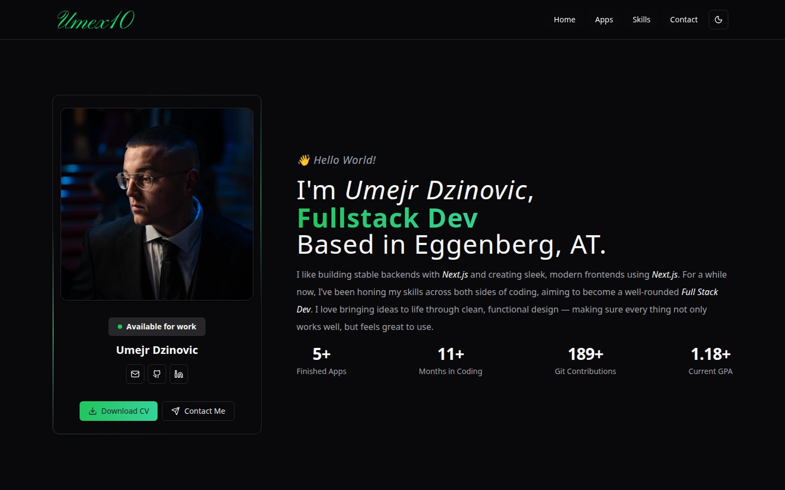
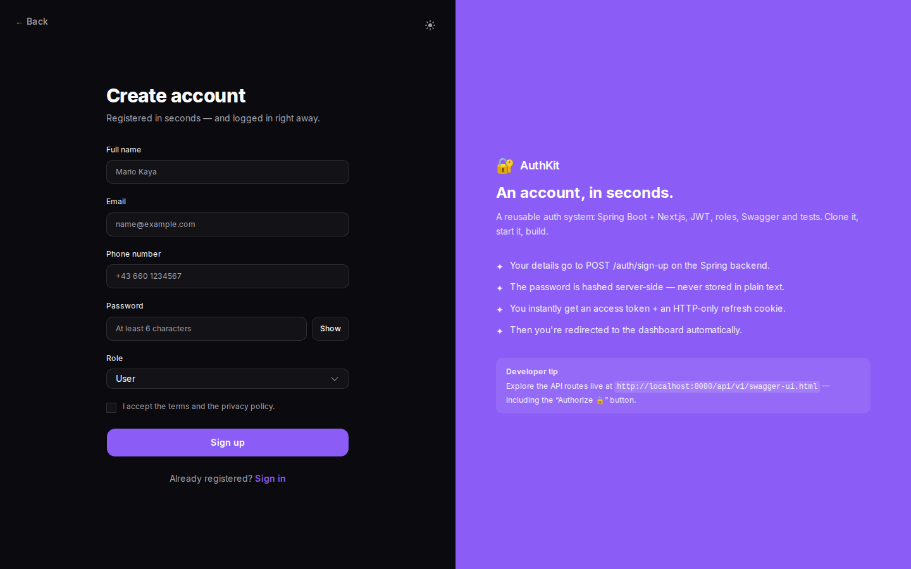
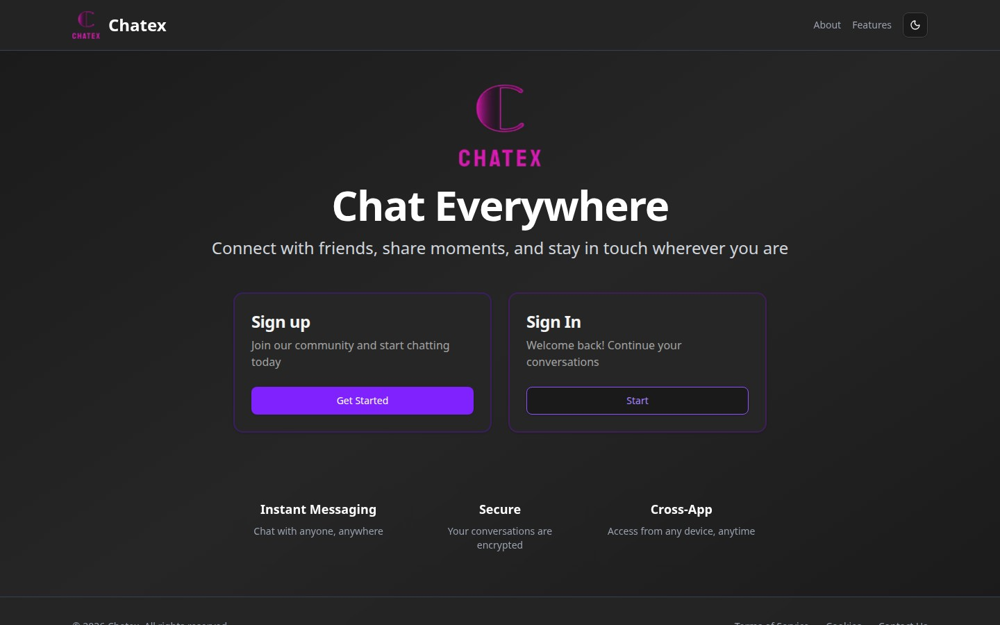
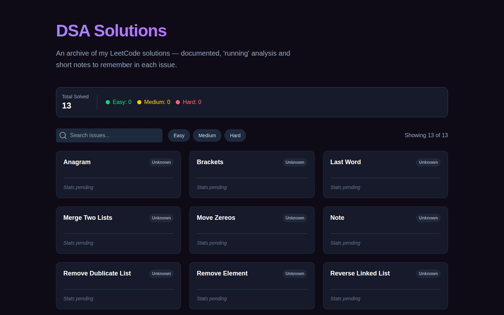
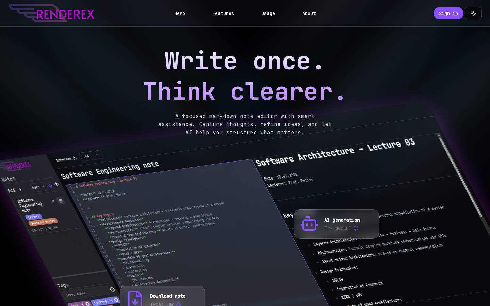

```text
             .::;;;||||(((|||;:     .           Umex10@github ----------------------------------------------
          .:;;|(((tttt(tt((tttt((|:   .         . OS: ........................................... Linux Mint
        :;;|(tttt((((((((((((((((ttt|.  .       . Host: ............................................... Graz
      .;||(ttt(((((((((((((((((((|((tt(:        . Kernel: ..................... Software Engineering Student
     ;|;(ttt((tttt((((((((((((((((((|((tt. .    . IDE: .............................................. VSCode
  .|.t##wkkkwkjjfftftt((((tt((((((((((((|(f| .                                                              
  |:f%%%%%%%###wwwkjjjkjjfft((((((((((((((((:   . Languages: ...................................... Java, TS
 |;(%%%%@@@@@@%%%%%%%%#kjftttt(((((((((((((((   . Languages.Frameworks: .................... Next.js, S-Boot
:|.%%#%@@@@@@@@@@%%%%#wkjjft(tfjjft((((f(((((;  . Languages.Markup: ................... HTML, CSS, SQL, YAML
| k@@@@@@@@@@@@@@@@@@@%%%kkkw##wftttttjt(t((((                                                              
|.%@@@@@@@@@@@@@@@@@@@@@%##%wkjffffjjjj(ft((tf  . Hobbies.Software: .................. Coding fullstack apps
;(%%@@@@@@@@@@@@@@@@@@@@@%%#kkkkwwwwkwkjjtttf(  . Hobbies.Focus: .................. Auth systems, clean APIs
 f%%@@@@@@@@@@@@@@@@@@@@%%%###%%%%%##%wwjfjjt(                                                              
:t%%%@@@@@@@@@@@@@@@@@@@%%#%%%@@@@@@@%%%kwkftt  Contact ----------------------------------------------------
;|w%%%@@@@@@@@@@@@@@@@@@@%%%@@@@@@@@@@@@@#kjft  . Work: ........................... umi.dzinovic10@gmail.com
:;fw%%%%@@@@@@@@@@@@@@%%%@@@@@@@@@@@@@@@@%wjj(  . DevResume: ................... dev-resume-sigma.vercel.app
..fjw%%%%%%%@@@@@@%%%%%%%@@@@@@@@@@@@@@@%#kjf.  . GitHub: ........................................... Umex10
 .;jjjk#%%%%%%%%%%%%%%%%%@@@@@@@@@@@@@@%#wkj;                                                               
   |jjfj%###%%%%###%%#w#%@@@@@@@@@@@@@%#wkj| .  GitHub Stats -----------------------------------------------
  . (jjfk############%%%%@@@@@@@@@@@%#wkkj| .   . Reps: .................... 9 | Followers: 7 | Following: 5
   . |jkjjkw#######%#######%%@@@@%%#wkjjf: .    . Contributions: .......................... streak: 201 days
    . :fkjjjjwwwwkkjjjjjjjjkkwwwwkkkjjf|  .     . Labeld: ........................ authkit, chatex, renderex
     .  |tffft(|((|(ffjjjjjfffjjjffft|  .       . Stack.Live: ...................... Docker, Railway, Vercel
       .  ;||((ttttfffftttjfjftftt|:   .                                                                    
        ..   .;||(fft(((ttffft|;:   ..                                                                      
```

<div align="center">

<a href="https://dev-resume-sigma.vercel.app"></a>
<a href="mailto:Umejr.Dzinovic@edu.fh-joanneum.at"></a>

</div>

---

<div align="center">
  <a href="https://dev-resume-sigma.vercel.app">
    
  </a>
  <br/>
  <sub><b>dev-resume</b> · my portfolio & CV, built with Next.js · <a href="https://dev-resume-sigma.vercel.app">dev-resume-sigma.vercel.app</a></sub>
</div>

---

## 🔍 Dives

---

### 🔐 AuthKit — Drop-in Authentication Microservice

<table>
<tr>
<td width="45%" valign="top">
  <a href="https://github.com/Umex10/authkit">
    
  </a>
</td>
<td width="55%" valign="top">

A reusable, **production-style auth system** packaged as a monorepo: one **Spring Boot** backend and **two interchangeable frontends** — a **Next.js** web app and a **React Native (Expo)** mobile app — that both speak to the same API.

The security layer is fully **stateless JWT**: a short-lived **access token** (15 min) plus a long-lived **refresh token** (30 days) kept in an **HTTP-only cookie** on web and in the **device keystore** (`expo-secure-store`) on mobile. Role-based authorization (`USER` / `ADMIN`) via `@PreAuthorize`, a protected `GET /me` route, and a live **Swagger UI** with an `Authorize` 🔒 button.

Both clients use **Redux Toolkit Query** with silent token refresh and route guards — Server Actions on web, `AuthProvider` on mobile. One `docker compose up` brings up Postgres + backend, and it ships with tests everywhere: **Spring integration tests, Vitest + Playwright e2e (web), Jest + RN Testing Library (mobile)**.

`Java 21` `S-Boot` `Spring Security` `JWT` `PostgreSQL` `Next.js` `React 19` `React Native` `Expo` `RTK Query` `Tailwind` `Docker`

</td>
</tr>
</table>

---

### 💬 Chatex — Social Website

<table>
<tr>
<td width="55%" valign="top">

A social-Website with a auth system. The **S-Boot-Security** `Security-Chain` is fully stateless — CSRF disabled, CORS locked to the frontend origin.

Every request runs through a custom `JwtAuthentication` (`OncePerRequest`) that pulls the Bearer token from the `Authorization` header, validates it via **JWT**, and sets the `SecurityContextHolder` — giving every downstream controller direct access to the authenticated user. Token strategy: short-lived **access token** (15 min) + long-lived **refresh token** (30 days, HttpOnly cookie).

Users can post **Shouts**, manage their accounts (avatar, banner, bio, location), and the `AuthController` builds sign-up, sign-in, and token refresh endpoints.

`Next.js` `TS` `S-Boot` `S-Boot-Security` `JWT` `P-SQL` `Redux` `Shadcn/ui` `Container & Images`

</td>
<td width="45%" valign="top">
  <a href="https://github.com/Umex10/chatex">
    
  </a>
</td>
</tr>
</table>

---

### 🧩 LeetCode & DSA Exercises — Issue Solving

<table>
<tr>
<td width="45%" valign="top">
  <a href="https://github.com/Umex10/dsa-exercises-website">
    
  </a>
</td>
<td width="55%" valign="top">

A dedicated website where I thoroughly document my solved **LeetCode** issues and **Data Structures & Algorithms (DSA)** exercises.

Every solution is coded in **Java** and comes with an in-depth explanation of the underlying logic, accompanied by a precise **Time and Memory Complexity** analysis. The website features a robust **filtering system**, allowing users to easily search and sort issues. Built with **Next.js**.

`Java` `Next.js` `Algorithms` `DSA` `Time/Space Complexity` `Tailwind`

</td>
</tr>
</table>

---

### 📝 Renderex — AI-Driven Note-Taking

<table>
<tr>
<td width="55%" valign="top">

Modern note-taking where markdown meets AI. **Firebase** handles the entire backend — auth, database, protected routes, user-scoped data — all without running a server.

**Google Gemini** is wired in for context-aware content generation. Export to PDF, DOCX, Markdown or plain text, full tag system, dark/light theme with **Framer Motion** animations.

`Next.js` `TS` `Firebase` `Redux` `Gemini AI` `Framer Motion` `Tailwind`

</td>
<td width="45%" valign="top">
  <a href="https://github.com/Umex10/renderex">
    
  </a>
</td>
</tr>
</table>

---

### 🚕 Smart-Kassa — Taxi Register System with Live Track

A **Team-built (in SCRUM) software** — a full register system for the taxi industry. I built and designed the entire UI and was fully responsible for the route system — **Leaflet** for the interactive map, **live GPS tracking** during rides, turn-by-turn navigation to the destination. The **All Rides** view lists every recorded trip with sorting and animated entries. I also built the **Summary** page, the **Dashboard** with analytics, and the **Settings** — everything the driver actually interacts with every shift.

`React` `TS` `Leaflet` `Redux` `Tailwind` `Shadcn/ui` `Framer Motion` `Node.js` `Express` `PostgreSQL`

---

## 🛠️ Tech Stack

<div align="center">


</div>

---

<div align="center">
<sub>Built by hand. No shortcuts.</sub>
</div>
