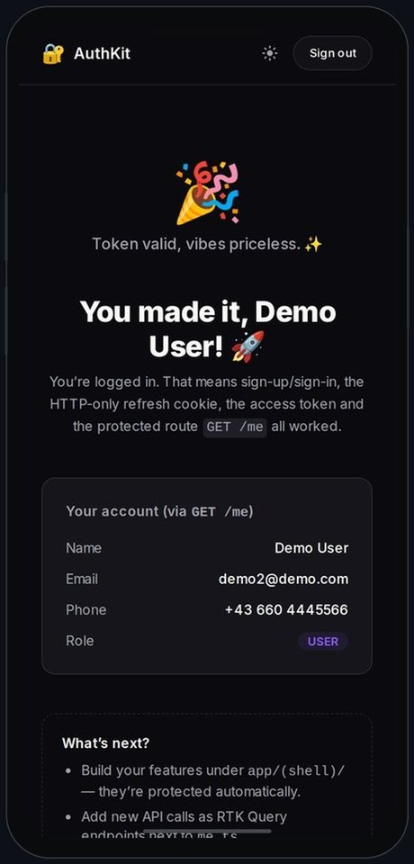
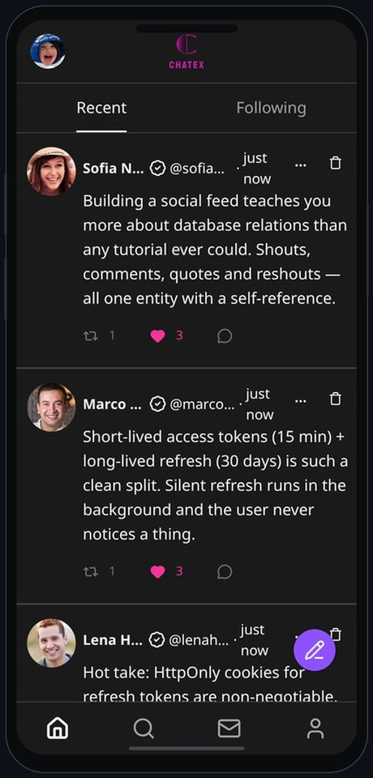
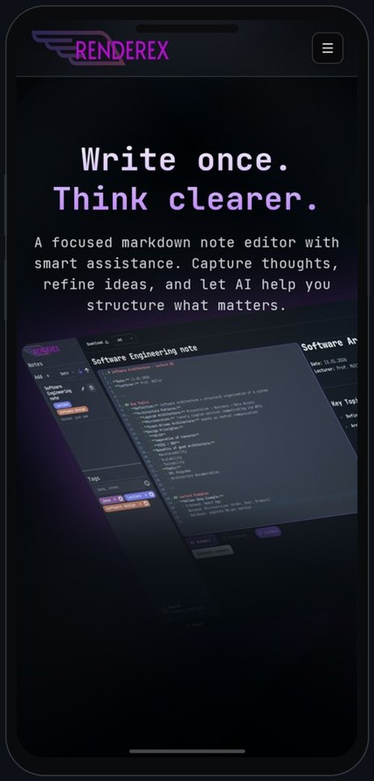
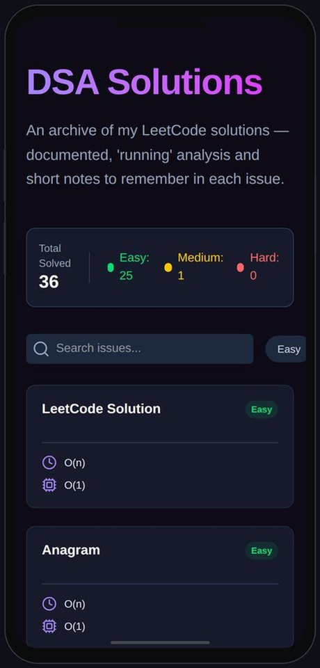
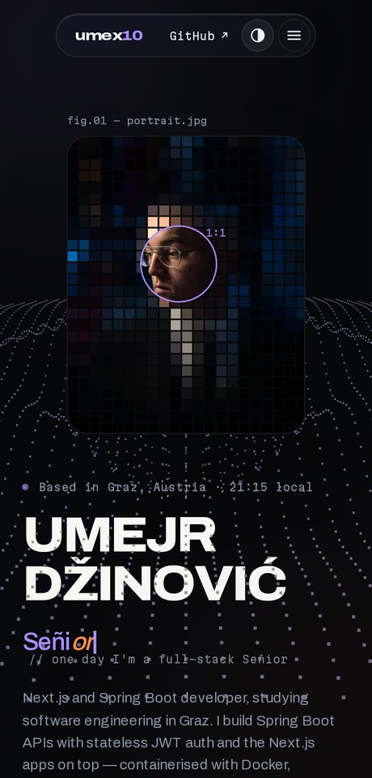

  <a href="https://dev-resume-v2.vercel.app"><b>dev-resume-v2.vercel.app</b></a>
  &nbsp;·&nbsp;
  <a href="mailto:umi.dzinovic10@gmail.com">umi.dzinovic10@gmail.com</a>

Next.js and Spring Boot developer, studying software engineering at FH JOANNEUM. I build Spring Boot APIs with stateless JWT auth and the Next.js apps on top — containerised with Docker, shipped through CI/CD. Currently writing my bachelor thesis and learning Kubernetes, gRPC and microservices.

 

`02 / shell`

## Ask the terminal.

The real one lives on [my site](https://dev-resume-v2.vercel.app/#shell) — try `help`, `open authkit`, `accent orange` or `sudo hire-me`.

 

`03 / work`

## Selected work.

> **● currently building — Overex** · project work + bachelor thesis
>
> Flash-sale ticketing on Kubernetes. Thousands of buyers, one last ticket — the platform has to stay up and must never sell it twice. Spring Boot microservices, gRPC between services, RS256 JWTs from my AuthKit.
>
> **Thesis:** strategies against overselling at 1 / 3 / 5 / 10 replicas — **ticket lock system** · Redis reservation · queue with Kafka.
>
> `Java 21` `Spring Boot` `Microservices` `gRPC` `Kubernetes` `Docker` `PostgreSQL` `Redis` `Kafka`

<table>
<tr>
<td width="26%" valign="top">
  
</td>
<td width="74%" valign="top">

### AuthKit — authentication microservice

**[github.com/Umex10/authkit](https://github.com/Umex10/authkit)**

A drop-in auth microservice — one **Spring Boot** API, two interchangeable clients: a **Next.js** web app and a **React Native (Expo)** app that speak to the same backend.

Fully **stateless JWT**: a short-lived access token plus a long-lived refresh token, kept in an HTTP-only cookie on the web and in the device keystore on mobile. Role-based access with `@PreAuthorize`, a protected `GET /me` and a live **Swagger UI**. One `docker compose up` brings up Postgres and the backend; tested with JUnit 5, MockMvc, Vitest and Playwright.

`Java 21` `Spring Boot 4` `Spring Security` `JWT` `PostgreSQL` `Next.js 16` `React Native` `RTK Query` `Docker`

</td>
</tr>
</table>

<table>
<tr>
<td width="26%" valign="top">
  
</td>
<td width="74%" valign="top">

### Chatex — social website

**[github.com/Umex10/chatex](https://github.com/Umex10/chatex)**

Shouts, reshouts and real-time chat on a fully stateless security chain. Every request runs through a custom `JwtAuthenticationFilter` that validates the Bearer token and fills the `SecurityContextHolder` — CSRF off, CORS locked to the frontend origin.

Users post **Shouts** with likes, reshouts, quotes and comments, follow each other, chat over **WebSocket** and manage their profiles.

`Next.js` `TypeScript` `Spring Boot` `Spring Security` `JWT` `PostgreSQL` `Redux` `WebSocket` `shadcn/ui` `Docker`

</td>
</tr>
</table>

<table>
<tr>
<td width="26%" valign="top">
  
</td>
<td width="74%" valign="top">

### Renderex — AI note-taking

**[github.com/Umex10/renderex](https://github.com/Umex10/renderex)**

Modern note-taking where markdown meets AI. **Firebase** carries the backend — auth, database and user-scoped data without running a server — and **Gemini** writes along with you. Export to PDF, DOCX, Markdown or plain text, tags, dark and light theme.

`Next.js` `TypeScript` `Firebase` `Redux` `Gemini AI` `Framer Motion` `Tailwind`

</td>
</tr>
</table>

<table>
<tr>
<td width="26%" valign="top">
  
</td>
<td width="74%" valign="top">

### DSA Solutions — LeetCode & algorithms

**[github.com/Umex10/dsa-exercises-website](https://github.com/Umex10/dsa-exercises-website)** · **[exercises repo](https://github.com/Umex10/dsa-exercises)**

Solved **LeetCode** issues and data-structures exercises, each in **Java** with an explanation of the idea and its **time and space complexity**. The site pulls solutions and notes straight from the exercises repo through the **GitHub API**, with filters by difficulty.

`Java` `Next.js` `Algorithms` `DSA` `GitHub API` `Tailwind`

</td>
</tr>
</table>

<table>
<tr>
<td width="26%" valign="top">
  
</td>
<td width="74%" valign="top">

### Dev-Resume v2 — this portfolio

**[dev-resume-v2.vercel.app](https://dev-resume-v2.vercel.app)** · **[github.com/Umex10/dev-resume-v2](https://github.com/Umex10/dev-resume-v2)**

A zsh terminal you can actually type into, project deep dives with real source code from the repos, a live GitHub contribution skyline in three.js and the pipeline below. Built on **Next.js 16** with Cache Components and intercepting routes; tested with Vitest and Playwright on desktop and mobile.

`Next.js 16` `React 19` `TypeScript` `Tailwind 4` `shadcn/ui` `React Three Fiber` `Shiki` `Playwright` `Vercel`

</td>
</tr>
</table>

 

`05 / ship`

## Commit to container.

- **docker** — multi-stage images for every service; one `docker compose up` brings up Postgres, the backend and Swagger.
- **ci/cd** — GitHub Actions: test → build → image → deploy. Railway for the Spring Boot side, Vercel for Next.js.
- **testing** — JUnit 5, MockMvc and Spring Security Test on the backend; Vitest, Testing Library and Playwright on the web.

 

`06 / stack`

## The toolbox.

| | |
| --- | --- |
| **Strengths** | Spring Boot · Next.js · JWT (HS256 / RS256) · Spring Security |
| **Languages** | Java · TypeScript · JavaScript · SQL · HTML/CSS · YAML |
| **Backend** | REST · WebSocket · JPA · Swagger · PostgreSQL · Firebase |
| **Frontend** | React 19 · Server Actions · proxy / middleware · instrumentation · Tailwind · shadcn/ui · RTK Query |
| **Mobile** | React Native · Expo |
| **Testing** | JUnit 5 · MockMvc · Vitest · Testing Library · Playwright |
| **Ship** | Docker · Docker Compose · GitHub Actions · CI/CD · Railway · Vercel · Git |
| **Learning** | Kubernetes · gRPC · Microservices · Redis · Kafka |

 

`07 / contact`

## Let's talk.

Got a role, a project, or a bug that needs squashing? **[umi.dzinovic10@gmail.com](mailto:umi.dzinovic10@gmail.com)** · **[dev-resume-v2.vercel.app](https://dev-resume-v2.vercel.app)**

Built by hand. No shortcuts. One day a Señior.
